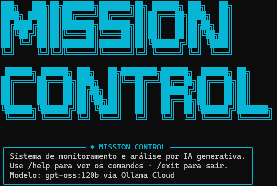
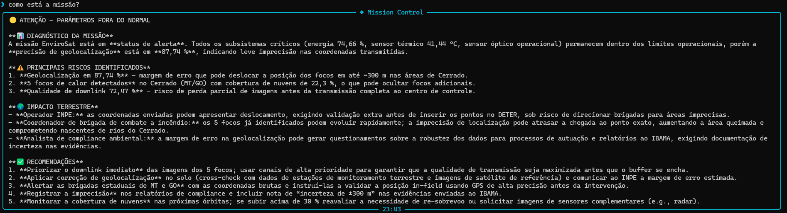

# 🛰️ Mission Control AI — EnviroSat

> Sistema inteligente de monitoramento ambiental orbital com análise por IA generativa.

---

## 👥 Integrantes

| Nome Completo    | RM     | Turma |
|------------------|--------|-------|
| Victor Binot     | 571499 | 1CCPI |
 | Gustavo Kunitaki | 571400 | 1CCPI |


---

## 🌳 O que o projeto faz

O **EnviroSat Mission Control AI** é um sistema de monitoramento operacional de um satélite de observação ambiental em órbita baixa (LEO), similar ao Amazônia-1 e Landsat. O sistema simula dados de telemetria em tempo real — temperatura de sensores, focos de incêndio detectados, energia disponível, buffer de imagens, qualidade de downlink e precisão de geolocalização — avalia anomalias via lógica Python com thresholds definidos, e utiliza **IA generativa via Ollama Cloud** para interpretar o estado da missão em linguagem natural, articulando o impacto terrestre de cada alerta para brigadas, INPE e analistas de compliance ambiental.

---

## 🎯 Persona atendida

O sistema serve a **três perfis**:

- **Operador de centro de controle (INPE / órgão estadual):** recebe diagnóstico técnico preciso e ações recomendadas para cada anomalia.
- **Coordenador de brigada de combate a incêndio:** entende onde agir e com que urgência, mesmo sem ser especialista em satélites.
- **Analista de compliance ambiental:** obtém contexto de impacto regulatório para relatórios ao IBAMA.

---

## 🔧 Tecnologias utilizadas

- Python 3.10+
- Ollama Cloud API — modelo `gpt-oss:120b`
- `ollama==0.6.2` — cliente Python para Ollama Cloud
- `rich==15.0.0` — renderização de painéis e tabelas no terminal
- `prompt-toolkit==3.0.52` — input interativo com histórico (setas ↑↓)
- `pyfiglet==1.0.4` — banner ASCII art
- `python-dotenv==1.2.2` — gerenciamento de credenciais via `.env`

---

## ▶️ Como executar
> ⚠️ **Importante:** este projeto utiliza `prompt-toolkit` para a interface CLI interativa.
> Para rodar pelo terminal do PyCharm, é necessário habilitar a opção **"Emulate terminal in output console"**:
> vá em **Run → Edit Configurations → Modify options** e marque essa opção.
> Sem isso, o PyCharm não reconhece o console como um terminal real e o projeto não abre corretamente.
> Alternativamente, você também pode rodar pelo **cmd.exe** ou **PowerShell** do Windows diretamente,
> sem nenhuma configuração adicional.
```bash
# 1. Clone o repositório
git clone https://github.com/victorcbinot/MISSION-CONTROL-AI--GS
cd mission-control-ai

# 2. Crie o ambiente virtual
python -m venv .venv
source .venv/bin/activate        # Linux/Mac
.venv\Scripts\activate           # Windows

# 3. Instale as dependências
pip install -r requirements.txt

# 4. Configure as credenciais
cp .env.example .env
# Edite o .env e adicione sua chave Ollama Cloud:
# OLLAMA_API_KEY=sua_chave_aqui

# 5. Execute
python main.py
```

---

## 💻 Comandos disponíveis na CLI

| Comando | Descrição |
|---|---|
| `/status` | Exibe painel completo de telemetria e alertas ativos |
| `/help` | Lista todos os comandos disponíveis |
| `/about` | Informações sobre o projeto e a trilha EnviroSat |
| `/clear` | Limpa o terminal e reexibe o banner |
| `/exit` | Encerra o sistema |
| `[qualquer texto]` | Envia pergunta para análise da IA com dados reais da missão |

---

## 📸 Demonstração

### Banner e status inicial


### Análise de alerta crítico pela IA


---

## 🧠 System Prompt

O system prompt completo está em [`prompts/system_prompt.md`](prompts/system_prompt.md).

**Destaques do design do prompt:**
- Define 3 personas de usuário (operador, coordenador de brigada, analista ambiental)
- Contextualiza os 5 biomas monitorados com suas especificidades
- Exige que toda análise conecte a anomalia técnica ao impacto terrestre concreto
- Inclui exemplo de resposta de referência (few-shot)
- Define formato estruturado de saída: Diagnóstico → Riscos → Impacto Terrestre → Recomendações

**Iterações do prompt:**
- **v1:** Prompt genérico — modelo respondia sem citar impacto terrestre
- **v2:** Adicionadas personas e seção de biomas — melhora na contextualização
- **v3:** Incluído exemplo de referência (few-shot) — respostas ficaram mais estruturadas e acionáveis

---

## 🧪 Cenários de teste demonstrados

| Cenário | Descrição |
|---|---|
| **Normal** | Todos os parâmetros dentro do esperado, operação nominal |
| **Alerta** | Sensor óptico degradado, energia baixa, 10 focos no Cerrado |
| **Crítico** | Sensor em falha, 25 focos no Pantanal, energia em 15%, buffer saturado |
| **Simulado** | Telemetria gerada aleatoriamente a cada execução com chance de anomalia |

---

## ⚠️ Limitações conhecidas

- Os dados de telemetria são **simulados** — não há conexão real com nenhum satélite.
- A IA pode apresentar variações de resposta entre execuções (comportamento não-determinístico do LLM).
- O sistema não persiste histórico entre sessões — o contexto de ciclos anteriores é resetado ao reiniciar.
- Não foram implementadas múltiplas chamadas LLM encadeadas (ex: classificação de severidade + plano de ação separados).

---

## 💼 Proposta de valor / modelo de negócio

### 1. Qual o problema real terrestre que esta missão resolve?

O Brasil perde centenas de milhares de hectares de vegetação nativa por ano para desmatamento e incêndios, e o principal entrave não é a falta de satélites, é o tempo entre a detecção orbital e a resposta de quem está em campo. Operadores precisam interpretar dados brutos de telemetria em tempo real, muitas vezes sem ferramentas adequadas para traduzir esses números em decisões. O EnviroSat resolve esse problema entregando alertas contextualizados em linguagem natural diretamente para brigadas, analistas do INPE e equipes de compliance, reduzindo o tempo de reação e aumentando a efetividade do monitoramento ambiental.

### 2. Quem paga pela solução?

O modelo de financiamento é híbrido. O setor público, INPE, IBAMA e Secretarias Estaduais de Meio Ambiente, representa cerca de 60% da receita, já que hoje financia sistemas como DETER e PRODES e teria interesse direto em uma camada de análise inteligente integrada a esses produtos. Os outros 40% vêm do setor privado: empresas com obrigações ESG, cooperativas agrícolas e fundos de crédito de carbono que precisam de relatórios auditáveis sobre a integridade de suas áreas de reserva legal.

### 3. Métrica de impacto

Se o EnviroSat operar com saúde plena por 1 ano, o impacto estimado é o monitoramento contínuo de aproximadamente 120 milhões de hectares nos biomas prioritários brasileiros. O tempo médio de resposta das brigadas a focos detectados cairia de cerca de 48 horas para aproximadamente 12 horas, uma redução de 30 a 40%, o que faz diferença direta na contenção de incêndios antes que se tornem desastres. Em termos climáticos, a contenção precoce de queimadas tem potencial de evitar a emissão de cerca de 2 milhões de toneladas de CO₂ por ano. Além disso, o sistema geraria dados suficientes para embasar aproximadamente 500 relatórios de compliance ambiental anuais para órgãos reguladores.

### 4. Modelo de negócio

O modelo adotado é Dado-como-serviço (DaaS) combinado com SaaS de análise. Órgãos públicos pagam uma assinatura anual pelo acesso à plataforma de alertas e relatórios automáticos integrados aos seus sistemas de monitoramento. Empresas privadas pagam por relatório de compliance gerado, de acordo com a demanda. Fundos de carbono e seguradoras rurais pagam por certificações de monitoramento contínuo de áreas de preservação, usando os dados do satélite como evidência auditável.

---

## 🎬 Vídeo de demonstração

🔗 [Assistir demonstração no YouTube](https://www.youtube.com/watch?v=pIVfq_M7Sy8)

> Configurado como "Não listado" no YouTube.

---

## 📁 Estrutura do projeto

```
mission-control-ai/
├── README.md
├── main.py
├── banner_ascii.py
├── requirements.txt
├── .env.example
├── .gitignore
├── src/
│   ├── __init__.py
│   ├── ui.py
│   ├── engine.py
│   ├── telemetria.py
│   └── alertas.py
├── prompts/
│   └── system_prompt.md
├── data/
│   └── cenarios.json
└── assets/
    ├── screenshot_banner.png
    └── screenshot_analise.png
```
